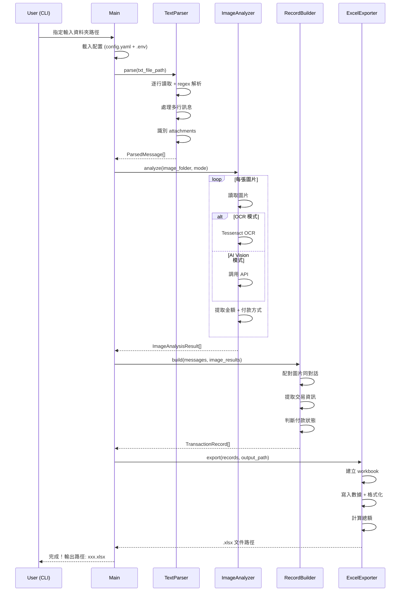
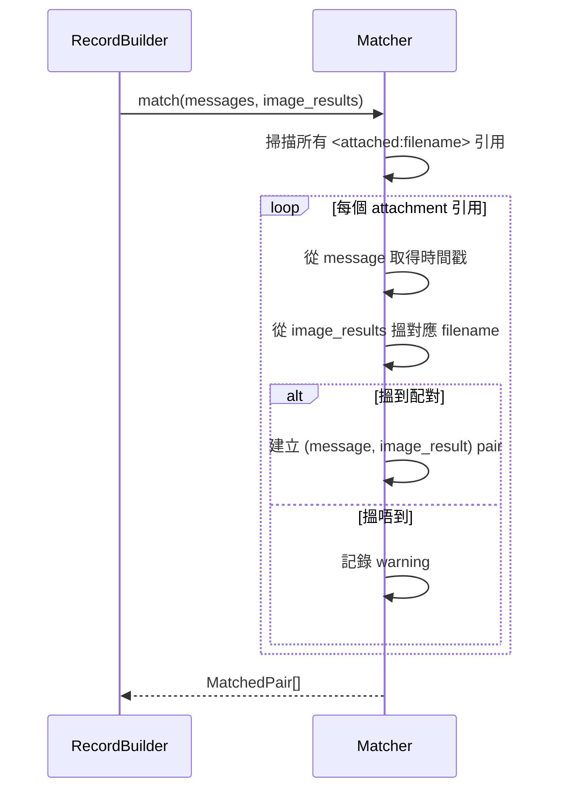
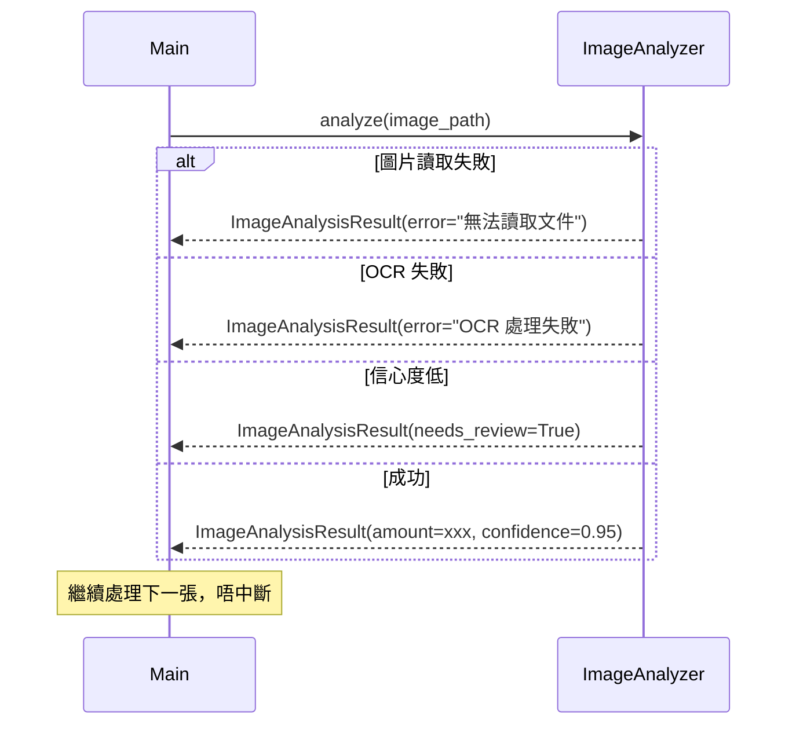

# Design: WhatsApp 帳目分析系統

## Architecture Overview

系統採用 **Pipeline 架構**，四個模組按順序處理數據：

```
Input Files (.txt + images)
        │
        ▼
┌─────────────────────┐
│  WhatsApp Text      │
│  Parser             │──→ ParsedMessages[]
└─────────────────────┘
        │
        ▼
┌─────────────────────┐
│  Image Analyzer     │──→ ImageAnalysisResult[]
│  (OCR / AI Vision)  │
└─────────────────────┘
        │
        ▼
┌─────────────────────┐
│  Transaction Record │──→ TransactionRecord[]
│  Builder            │
└─────────────────────┘
        │
        ▼
┌─────────────────────┐
│  Excel Exporter     │──→ .xlsx file
└─────────────────────┘
```

**設計原則：**
- 模組間透過定義好嘅 data model 通訊
- 每個模組可獨立測試
- Pipeline 可中斷恢復（每步產出 JSON 中間結果）
- 錯誤隔離：單個圖片/訊息失敗唔影響整體

---

## Technical Decisions

| 決策 | 選擇 | 原因 | 替代方案 |
|------|------|------|----------|
| 程式語言 | Python 3.9+ | 用戶指定；豐富嘅 NLP/OCR 生態 | - |
| OCR 引擎 | Tesseract (pytesseract) | 免費、離線可用、支援中文 | EasyOCR（較慢） |
| AI Vision | OpenAI Vision API | 準確度高、支援中文 | Google Cloud Vision |
| Excel 生成 | openpyxl | 成熟穩定、支援 .xlsx | xlsxwriter |
| 數據模型 | Pydantic | 類型安全、驗證、序列化 | dataclasses |
| CLI 框架 | Click | 簡單易用、文檔完善 | argparse、typer |
| 圖片處理 | Pillow (PIL) | 標準 Python 圖片庫 | opencv |
| 配置管理 | python-dotenv + YAML | API Key 用 .env，其他用 YAML | toml |
| 日誌 | logging (stdlib) | 內建、夠用 | loguru |
| 測試框架 | pytest | Python 標準選擇 | unittest |
| 套件管理 | pip + requirements.txt | 簡單直接 | poetry |

---

## Data Model

### ParsedMessage
```python
class ParsedMessage(BaseModel):
    timestamp: datetime
    sender: str
    content: str
    is_system_message: bool = False
    attachments: list[str] = []  # filename list
    raw_text: str  # 原始文字（debug 用）
```

### ImageAnalysisResult
```python
class ImageAnalysisResult(BaseModel):
    filename: str
    image_date: date | None  # 從文件名提取
    analysis_mode: Literal["ocr", "ai_vision"]
    payment_method: Literal["payme", "fps", "bank_transfer", "unknown"] | None
    amount: Decimal | None
    transaction_date: date | None
    transaction_id: str | None
    confidence: float  # 0.0 - 1.0
    raw_text: str | None  # OCR 提取嘅原始文字
    needs_review: bool = False  # 信心度低時標記
    error: str | None = None  # 分析失敗時記錄原因
```

### TransactionRecord
```python
class TransactionRecord(BaseModel):
    id: str  # UUID
    date: date
    customer_name: str
    repair_item: str | None
    quoted_amount: Decimal | None
    received_amount: Decimal | None
    payment_method: Literal["payme", "fps", "bank_transfer", "cash", "unknown"] | None
    payment_status: Literal["paid", "unpaid", "partial"]
    source_messages: list[int]  # message indices
    source_images: list[str]  # image filenames
    notes: str = ""
    confidence: float  # 整體信心度
    needs_review: bool = False
```

### AppConfig
```python
class AppConfig(BaseModel):
    analysis_mode: Literal["ocr", "ai_vision"] = "ocr"
    ai_vision_api_key: str | None = None
    tesseract_path: str | None = None  # Windows 需要指定路徑
    output_dir: str = "./output"
    confidence_threshold: float = 0.7
    language: str = "chi_tra+eng"  # Tesseract 語言包
```

---

## Component Structure

```
whatsapp-accounting/
├── README.md
├── requirements.txt
├── setup.py
├── .env.example              # API Key 範例
├── config.yaml               # 預設配置
│
├── src/
│   ├── __init__.py
│   ├── main.py               # CLI 入口點
│   ├── config.py             # 配置載入
│   │
│   ├── models/               # Data Models (Pydantic)
│   │   ├── __init__.py
│   │   ├── message.py        # ParsedMessage
│   │   ├── image_result.py   # ImageAnalysisResult
│   │   ├── transaction.py    # TransactionRecord
│   │   └── config.py         # AppConfig
│   │
│   ├── parser/               # Module 1: WhatsApp Text Parser
│   │   ├── __init__.py
│   │   ├── text_parser.py    # 主解析邏輯
│   │   ├── patterns.py       # Regex patterns
│   │   └── utils.py          # 時間格式轉換等工具
│   │
│   ├── analyzer/             # Module 2: Image Analyzer
│   │   ├── __init__.py
│   │   ├── base.py           # Abstract base class
│   │   ├── ocr_analyzer.py   # Tesseract OCR 實現
│   │   ├── ai_vision.py      # AI Vision API 實現
│   │   ├── payment_detector.py  # 付款方式識別
│   │   └── amount_extractor.py  # 金額提取
│   │
│   ├── builder/              # Module 3: Transaction Record Builder
│   │   ├── __init__.py
│   │   ├── record_builder.py # 主整合邏輯
│   │   ├── matcher.py        # 圖片-對話配對
│   │   ├── extractor.py      # 交易資訊提取
│   │   └── status_resolver.py # 付款狀態判斷
│   │
│   └── exporter/             # Module 4: Excel Exporter
│       ├── __init__.py
│       ├── excel_exporter.py # Excel 生成
│       └── formatters.py     # 欄位格式化
│
├── tests/
│   ├── __init__.py
│   ├── conftest.py           # pytest fixtures
│   ├── test_parser/
│   │   ├── __init__.py
│   │   ├── test_text_parser.py
│   │   └── test_patterns.py
│   ├── test_analyzer/
│   │   ├── __init__.py
│   │   ├── test_ocr_analyzer.py
│   │   └── test_payment_detector.py
│   ├── test_builder/
│   │   ├── __init__.py
│   │   └── test_record_builder.py
│   ├── test_exporter/
│   │   ├── __init__.py
│   │   └── test_excel_exporter.py
│   └── fixtures/             # 測試用嘅 sample data
│       ├── sample_chat.txt
│       ├── sample_images/
│       └── expected_output/
│
└── docs/
    └── usage.md              # 使用說明
```

---

## Sequence Diagrams

### 主流程



### 圖片-對話配對流程



### 錯誤處理流程



---

## Error Handling Approach

### 策略：Graceful Degradation（優雅降級）

| 層級 | 錯誤類型 | 處理方式 |
|------|----------|----------|
| 文件層 | .txt 文件唔存在/無法讀取 | 終止並顯示清晰錯誤訊息 |
| 文件層 | .txt 文件為空 | 終止並提示 |
| 解析層 | 單行解析失敗 | 記錄 warning，跳過該行，繼續 |
| 解析層 | 時間格式無法識別 | 嘗試所有已知格式，全部失敗則記錄 |
| 圖片層 | 單張圖片讀取失敗 | 記錄 error，跳過，繼續其他圖片 |
| 圖片層 | OCR 無結果 | 標記 needs_review，繼續 |
| 圖片層 | AI Vision API 失敗 | 回退到 OCR 模式（如可用） |
| 整合層 | 配對失敗 | 記錄 warning，交易紀錄標記為不完整 |
| 匯出層 | 寫入文件失敗 | 終止並顯示錯誤（權限/路徑問題） |

### 日誌分級
```
ERROR   → 需要用戶注意（文件唔存在、API 失敗）
WARNING → 可能影響結果（配對失敗、信心度低）
INFO    → 正常進度（處理中、完成）
DEBUG   → 開發用（regex match 詳情、API response）
```

### 中間結果保存
- 每個模組完成後將結果保存為 JSON（`output/intermediate/`）
- 如果後續步驟失敗，可以從中間結果恢復
- 避免重複處理已分析嘅圖片

---

## Testing Strategy

### 單元測試（Unit Tests）

| 模組 | 測試重點 | 覆蓋率目標 |
|------|----------|------------|
| Text Parser | regex patterns、多行處理、時間格式 | 90%+ |
| Image Analyzer | 金額提取、付款方式識別 | 80%+ |
| Record Builder | 配對邏輯、狀態判斷 | 85%+ |
| Excel Exporter | 欄位正確性、計算 | 80%+ |

### 整合測試（Integration Tests）
- 端到端測試：sample .txt + sample images → 驗證 .xlsx 輸出
- 使用 fixtures/ 入面嘅 sample data

### 測試數據
- `fixtures/sample_chat.txt`：包含各種格式嘅對話範例
- `fixtures/sample_images/`：包含 PayMe/FPS/銀行轉帳截圖範例
- `fixtures/expected_output/`：預期嘅 JSON 同 Excel 輸出

### Mock 策略
- AI Vision API：用 mock response 測試
- Tesseract：用預設嘅 OCR 結果 mock（避免依賴安裝）
- 文件系統：用 tmp_path fixture

---

## Dependencies

### 核心依賴

| 套件 | 版本 | 用途 |
|------|------|------|
| pydantic | ^2.0 | Data model 驗證 |
| openpyxl | ^3.1 | Excel 生成 |
| click | ^8.0 | CLI 框架 |
| pillow | ^10.0 | 圖片讀取/處理 |
| pytesseract | ^0.3.10 | Tesseract OCR wrapper |
| python-dotenv | ^1.0 | .env 文件載入 |
| pyyaml | ^6.0 | YAML 配置 |
| openai | ^1.0 | AI Vision API（可選） |

### 開發依賴

| 套件 | 版本 | 用途 |
|------|------|------|
| pytest | ^7.0 | 測試框架 |
| pytest-cov | ^4.0 | 覆蓋率報告 |

### 系統依賴

| 軟件 | 用途 | 備註 |
|------|------|------|
| Tesseract OCR | OCR 引擎 | 需要另外安裝 + 中文語言包 |
| Python 3.9+ | 運行環境 | - |

---

## Risks & Trade-offs

### 高風險

| # | 風險 | 影響 | 緩解措施 |
|---|------|------|----------|
| 1 | OCR 對中文轉帳截圖準確度低 | 金額提取錯誤 | 提供 AI Vision 模式作為備選；標記低信心度結果 |
| 2 | WhatsApp 匯出格式更新 | 解析失敗 | 模組化 regex patterns，易於更新；版本偵測 |
| 3 | 廣東話 NLP 分析困難 | 維修項目提取唔準確 | 用關鍵字匹配而非完整 NLP；允許人工補充 |

### 中風險

| # | 風險 | 影響 | 緩解措施 |
|---|------|------|----------|
| 4 | 付款截圖格式多樣 | 識別率低 | 針對 PayMe/FPS/銀行 App 分別訓練 patterns |
| 5 | 一個對話混合多個客戶交易 | 配對錯誤 | 用時間窗口 + context 分析區分 |
| 6 | Tesseract 安裝複雜（Windows） | 用戶安裝困難 | 提供詳細安裝指南；考慮打包 |

### Trade-offs

| 決策 | 好處 | 代價 |
|------|------|------|
| CLI 而非 GUI | 開發快、簡單 | 非技術用戶學習成本稍高 |
| Pydantic 而非 dataclass | 類型安全、驗證 | 多一個依賴 |
| 中間結果保存 JSON | 可恢復、可 debug | 多佔磁碟空間 |
| 雙模式（OCR + AI Vision） | 靈活、免費/付費都支援 | 維護兩套分析邏輯 |
| 關鍵字匹配而非 ML | 簡單、可預測 | 準確度有上限 |
