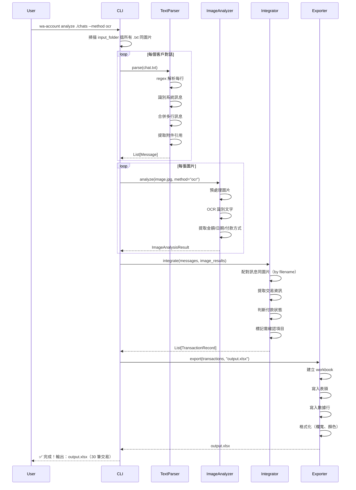
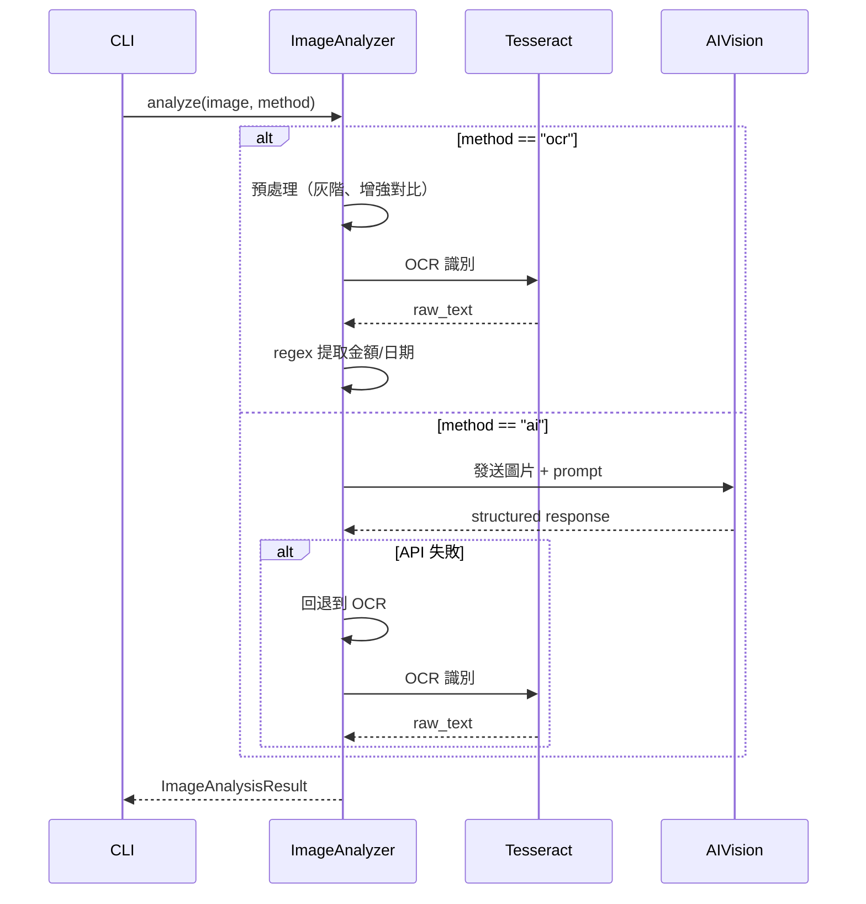

# Design: WhatsApp 帳目分析系統

## Architecture Overview

系統採用 **Pipeline 架構**，四個模組按順序執行，每個模組獨立處理一個階段嘅工作，透過 JSON 文件傳遞中間結果。

```
┌─────────────────────────────────────────────────────────────────┐
│                        CLI Entry Point                           │
│                      (main.py / cli.py)                          │
└─────────────┬───────────────────────────────────────────────────┘
              │
              ▼
┌─────────────────────────┐     ┌─────────────────────────┐
│  Module 1: Text Parser  │     │  Module 2: Image Analyzer│
│  (WhatsApp .txt 解析)    │     │  (OCR / AI Vision)       │
└───────────┬─────────────┘     └───────────┬─────────────┘
            │                               │
            │    structured messages         │    image analysis results
            ▼                               ▼
┌─────────────────────────────────────────────────────────────────┐
│              Module 3: Transaction Integrator                     │
│              (配對 + 整合 → 結構化交易紀錄)                        │
└─────────────────────────────────┬───────────────────────────────┘
                                  │
                                  │    transaction records (JSON)
                                  ▼
┌─────────────────────────────────────────────────────────────────┐
│              Module 4: Excel Exporter                             │
│              (JSON → .xlsx)                                       │
└─────────────────────────────────────────────────────────────────┘
```

**設計原則：**
- 每個模組可獨立運行同測試
- 中間結果以 JSON 文件保存，方便 debug 同人工修正
- Pipeline 可以從任何中間步驟重新開始（例如修正 JSON 後直接跑 Excel 匯出）

---

## Technical Decisions

| 決策項目 | 選擇 | 原因 |
|---------|------|------|
| 程式語言 | Python 3.9+ | 用戶指定；生態系統豐富 |
| CLI 框架 | `click` | 比 argparse 更易用，支援子命令 |
| 正則引擎 | Python `re` 標準庫 | 足夠處理 WhatsApp 格式 |
| OCR 引擎 | Tesseract + `pytesseract` | 免費、離線、社區活躍 |
| AI Vision | OpenAI GPT-4V / Anthropic Claude Vision | 準確度高，用戶可選 |
| Excel 生成 | `openpyxl` | 純 Python、支援 .xlsx、功能完整 |
| JSON 處理 | Python `json` 標準庫 | 無需額外依賴 |
| 圖片處理 | `Pillow` | OCR 前處理（裁剪、增強對比） |
| 配置管理 | `config.yaml` + `pyyaml` | 非技術用戶易於修改 |
| 日誌 | Python `logging` | 標準庫，零依賴 |
| 測試框架 | `pytest` | Python 社區標準 |
| 打包分發 | `pyinstaller`（可選） | 讓非技術用戶唔使裝 Python |

---

## Data Model

### Message（解析後嘅單條訊息）

```python
@dataclass
class Message:
    timestamp: datetime          # 訊息時間
    sender: str                  # 發送者名稱
    content: str                 # 訊息文字內容
    is_system_message: bool      # 係咪系統訊息
    attachments: list[str]       # 附件文件名列表
    raw_line: str                # 原始行（debug 用）
```

### ImageAnalysisResult（圖片分析結果）

```python
@dataclass
class ImageAnalysisResult:
    filename: str                # 圖片文件名
    is_transaction: bool         # 係咪交易截圖
    amount: float | None         # 交易金額
    currency: str                # 貨幣（預設 HKD）
    transaction_date: date | None # 交易日期
    payment_method: str | None   # 付款方式
    confidence: float            # 信心分數 0-1
    raw_text: str                # OCR 原始文字
    analysis_method: str         # "ocr" | "ai_vision"
    error: str | None            # 錯誤訊息（如有）
```

### TransactionRecord（整合後嘅交易紀錄）

```python
@dataclass
class TransactionRecord:
    date: date                   # 交易日期
    customer_name: str           # 客戶名稱
    repair_item: str             # 維修項目
    quoted_amount: float | None  # 報價金額
    received_amount: float | None # 實收金額
    payment_method: str          # 付款方式
    payment_status: str          # 已收/未收/部分收
    notes: str                   # 備註
    source_chat: str             # 來源對話文件
    source_images: list[str]     # 相關圖片
    confidence: float            # 整體信心分數
    needs_review: bool           # 是否需要人工確認
```

### JSON 中間格式

```json
{
  "metadata": {
    "source_file": "chat_with_customer_a.txt",
    "parse_date": "2024-01-15T10:30:00",
    "total_messages": 150,
    "total_images": 5
  },
  "messages": [...],
  "image_results": [...],
  "transactions": [...]
}
```

---

## Command Interface (CLI)

```bash
# 完整 pipeline：解析 → 分析 → 整合 → 匯出
wa-account analyze <input_folder> --output <output.xlsx> --method ocr|ai

# 單獨步驟
wa-account parse <input_folder> --output <parsed.json>
wa-account images <input_folder> --method ocr|ai --output <images.json>
wa-account integrate <parsed.json> <images.json> --output <transactions.json>
wa-account export <transactions.json> --output <output.xlsx>

# 配置
wa-account config --set api_key=xxx
wa-account config --set method=ocr

# 幫助
wa-account --help
```

### 命令參數說明

| 命令 | 參數 | 說明 |
|------|------|------|
| `analyze` | `input_folder` | WhatsApp 匯出文件夾路徑 |
| | `--output` | Excel 輸出路徑（預設 `./output.xlsx`） |
| | `--method` | 圖片分析方式：`ocr`（預設）或 `ai` |
| | `--config` | 配置文件路徑（預設 `./config.yaml`） |
| `parse` | `input_folder` | 只執行文字解析 |
| `images` | `input_folder` | 只執行圖片分析 |
| `integrate` | `parsed.json` `images.json` | 整合兩個 JSON |
| `export` | `transactions.json` | JSON → Excel |

---

## Sequence Diagrams (Mermaid)

### 完整 Pipeline 流程



### 圖片分析流程（OCR vs AI）



---

## Component Structure（目錄結構）

```
wa-account-analyzer/
├── README.md                    # 使用說明（中文）
├── pyproject.toml               # 項目配置 + 依賴
├── config.example.yaml          # 配置範例
├── src/
│   └── wa_account/
│       ├── __init__.py
│       ├── cli.py               # CLI 入口（click）
│       ├── config.py            # 配置管理
│       ├── models.py            # 數據模型（dataclass）
│       ├── text_parser/
│       │   ├── __init__.py
│       │   ├── parser.py        # 主解析邏輯
│       │   ├── patterns.py      # regex 模式定義
│       │   └── utils.py         # 輔助函數
│       ├── image_analyzer/
│       │   ├── __init__.py
│       │   ├── analyzer.py      # 分析器主邏輯（策略模式）
│       │   ├── ocr_engine.py    # Tesseract OCR 實現
│       │   ├── ai_engine.py     # AI Vision API 實現
│       │   ├── preprocessor.py  # 圖片預處理
│       │   └── extractors.py    # 金額/日期提取器
│       ├── integrator/
│       │   ├── __init__.py
│       │   ├── integrator.py    # 整合主邏輯
│       │   ├── matcher.py       # 對話-圖片配對
│       │   └── classifier.py    # 交易分類/狀態判斷
│       └── exporter/
│           ├── __init__.py
│           ├── excel_exporter.py # Excel 生成
│           └── formatters.py    # 格式化規則
├── tests/
│   ├── conftest.py              # pytest fixtures
│   ├── test_text_parser/
│   │   ├── test_parser.py
│   │   ├── test_patterns.py
│   │   └── fixtures/            # 測試用 .txt 文件
│   ├── test_image_analyzer/
│   │   ├── test_ocr.py
│   │   ├── test_ai.py
│   │   └── fixtures/            # 測試用圖片
│   ├── test_integrator/
│   │   ├── test_integrator.py
│   │   └── test_matcher.py
│   └── test_exporter/
│       └── test_excel.py
└── docs/
    └── user-guide.md            # 用戶使用指南
```

---

## Error Handling Approach

### 策略：Fail-Safe + Continue

```python
# 核心原則：單個錯誤唔影響整體流程
class ProcessingResult:
    successes: list[T]
    failures: list[ProcessingError]
    warnings: list[str]

class ProcessingError:
    source: str          # 出錯嘅文件/項目
    error_type: str      # 錯誤類型
    message: str         # 人類可讀嘅錯誤描述
    recoverable: bool    # 是否可恢復
```

### 錯誤分級

| 級別 | 處理方式 | 例子 |
|------|---------|------|
| FATAL | 停止整個 pipeline，通知用戶 | 輸入文件夾唔存在、權限不足 |
| ERROR | 跳過當前項目，繼續處理其他 | 單個 .txt 解析完全失敗 |
| WARNING | 記錄警告，繼續 | 圖片缺失、OCR 信心低 |
| INFO | 只記錄 | 跳過系統訊息 |

### 用戶反饋

```
處理完成！
✅ 成功：28 個對話、142 張圖片
⚠️  警告：3 張圖片 OCR 信心低（已標記需確認）
❌ 失敗：1 個文件編碼無法識別（chat_old.txt）

詳細日誌：./output/processing.log
```

---

## Testing Strategy

### 測試層級

| 層級 | 覆蓋範圍 | 工具 |
|------|---------|------|
| Unit | 每個函數/類 | pytest |
| Integration | 模組間數據傳遞 | pytest + fixtures |
| E2E | 完整 pipeline | pytest + 真實樣本數據 |

### 測試重點

1. **Text Parser**
   - 各種時間戳格式
   - 多行訊息合併
   - 系統訊息過濾
   - 附件引用提取
   - 編碼處理

2. **Image Analyzer**
   - OCR 金額提取（各種格式：$500、HKD 500、500元）
   - 非交易圖片識別
   - 圖片預處理效果
   - API 失敗回退

3. **Integrator**
   - 正確配對對話同圖片
   - 多筆交易識別
   - 金額矛盾處理
   - 付款狀態判斷

4. **Exporter**
   - Excel 格式正確
   - 中文字符顯示
   - 大量數據性能

### 測試數據

- 準備 5-10 個真實格式嘅 mock WhatsApp 對話
- 準備 10-20 張 mock 轉帳截圖（各種付款平台）
- 包含各種 edge case（見 Requirements EC-001 到 EC-010）

---

## Dependencies

### 核心依賴

| 套件 | 版本 | 用途 |
|------|------|------|
| `click` | ^8.1 | CLI 框架 |
| `openpyxl` | ^3.1 | Excel 生成 |
| `pytesseract` | ^0.3.10 | Tesseract OCR Python 封裝 |
| `Pillow` | ^10.0 | 圖片處理 |
| `pyyaml` | ^6.0 | 配置文件解析 |

### 可選依賴（AI Vision）

| 套件 | 版本 | 用途 |
|------|------|------|
| `openai` | ^1.0 | GPT-4V API |
| `anthropic` | ^0.18 | Claude Vision API |

### 開發依賴

| 套件 | 版本 | 用途 |
|------|------|------|
| `pytest` | ^7.4 | 測試框架 |
| `pytest-cov` | ^4.1 | 測試覆蓋率 |

### 系統依賴

| 軟件 | 說明 |
|------|------|
| Tesseract OCR | 需要系統安裝（Windows: installer、macOS: brew） |
| Python 3.9+ | 運行環境 |

---

## Risks & Trade-offs

| # | 風險 | 影響 | 緩解措施 |
|---|------|------|---------|
| R-001 | Tesseract OCR 對中文轉帳截圖準確度低 | 金額識別錯誤率高 | 提供 AI Vision 作為高準確度選項；OCR 結果標記信心分數 |
| R-002 | WhatsApp 匯出格式因版本/地區而異 | 解析失敗 | 支援多種格式 + 自動偵測；提供手動指定格式選項 |
| R-003 | 廣東話口語表達多樣 | 維修項目/金額提取困難 | 用關鍵字匹配而非 NLP；標記低信心結果讓用戶確認 |
| R-004 | AI Vision API 成本 | 大量圖片分析費用高 | 預設用免費 OCR；AI 模式前顯示預估費用 |
| R-005 | 非技術用戶安裝 Tesseract 困難 | 用戶無法使用 OCR 功能 | 提供詳細安裝指南；考慮未來用 PyInstaller 打包 |
| R-006 | 對話中交易資訊分散 | 整合困難，遺漏交易 | 用時間窗口 + 上下文分析；標記「可能遺漏」 |

### Trade-offs

| 決策 | 取捨 | 理由 |
|------|------|------|
| CLI 而非 GUI | 犧牲易用性換取開發速度 | 第一版快速交付；GUI 可後續加 |
| JSON 中間格式 | 多一步操作但可 debug | 非技術用戶可能唔識睇 JSON，但方便開發同修正 |
| 雙引擎（OCR + AI） | 增加複雜度 | 滿足唔同預算需求；OCR 免費但唔準，AI 準但要錢 |
| 關鍵字匹配而非 NLP | 準確度有限但簡單可靠 | 避免引入重型 NLP 依賴；廣東話 NLP 工具有限 |
