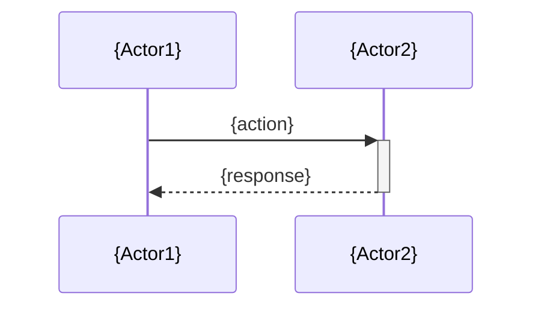
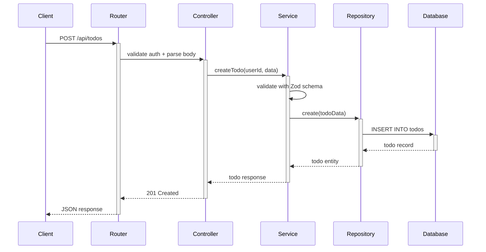

# Design: {spec-name}

## Architecture Overview
{高層次描述系統點運作}

## Technical Decisions

| Decision | Choice | Rationale |
|----------|--------|-----------|
| {決定點} | {選擇} | {理由} |

## Data Model

### {Entity Name}
| Field | Type | Description | Constraints |
|-------|------|-------------|-------------|
| {field} | {type} | {描述} | {約束} |

## API Design

### {METHOD} {path}
- **Description**: {做咩}
- **Auth**: {認證要求}
- **Request Body**:
```json
{request schema}
```
- **Response** ({status code}):
```json
{response schema}
```
- **Error Cases**:
  - `{status code}`: {描述}

## Sequence Diagrams

### {Flow Name}


## Component Structure

```
{目錄結構}
```

## Error Handling Approach
- {策略描述}

## Testing Strategy

| Layer | Approach | Tools |
|-------|----------|-------|
| Unit | {描述} | {工具} |
| Integration | {描述} | {工具} |
| E2E | {描述} | {工具} |

## Dependencies
- {外部依賴}
- {內部依賴}

## Risks & Trade-offs

| Risk | Impact | Mitigation |
|------|--------|------------|
| {風險} | {影響} | {方案} |

---

## 實例

### 實例 1：Todo API Design

```markdown
# Design: Todo CRUD API

## Architecture Overview
喺現有 Express app 加入 Todo module，用 layered architecture（Route → Controller → Service → Repository）。每層有明確職責，方便測試同維護。

## Technical Decisions

| Decision | Choice | Rationale |
|----------|--------|-----------|
| ORM | Prisma | 現有項目已用 Prisma |
| Validation | Zod | 輕量、TypeScript-first |
| Pagination | Cursor-based | 比 offset 更穩定，適合即時數據 |
| Error format | RFC 7807 | 標準化 error response |

## Data Model

### Todo
| Field | Type | Description | Constraints |
|-------|------|-------------|-------------|
| id | UUID | Primary key | auto-generated |
| title | string(200) | 標題 | NOT NULL |
| description | text | 描述 | nullable |
| status | enum | pending/in_progress/completed | default: pending |
| due_date | datetime | 截止日期 | nullable |
| user_id | UUID | FK → User.id | NOT NULL |
| created_at | datetime | 建立時間 | auto |
| updated_at | datetime | 更新時間 | auto |

## API Design

### POST /api/todos
- **Description**: 建立新 Todo
- **Auth**: Bearer token (required)
- **Request Body**:
```json
{
  "title": "買牛奶",
  "description": "去超市買",
  "due_date": "2026-05-28T18:00:00Z"
}
```
- **Response** (201):
```json
{
  "id": "uuid-here",
  "title": "買牛奶",
  "status": "pending",
  "created_at": "2026-05-27T10:30:00Z"
}
```
- **Error Cases**:
  - `400`: Validation error (title empty or too long)
  - `401`: Unauthorized

### GET /api/todos
- **Description**: 列出當前用戶嘅 Todos
- **Auth**: Bearer token (required)
- **Query Params**: `?status=pending&cursor=xxx&limit=20`
- **Response** (200):
```json
{
  "data": [...],
  "nextCursor": "xxx",
  "hasMore": true
}
```

## Sequence Diagrams

### Create Todo Flow


## Component Structure

```
src/
├── modules/
│   └── todo/
│       ├── todo.route.ts
│       ├── todo.controller.ts
│       ├── todo.service.ts
│       ├── todo.repository.ts
│       ├── todo.schema.ts (Zod)
│       └── todo.types.ts
└── prisma/
    └── migrations/
        └── add_todo_table.sql
```

## Error Handling Approach
- Controller 層捕捉 Zod validation errors → 轉換為 400 response
- Service 層拋出 domain-specific errors（NotFound, Forbidden）
- Global error handler 統一格式化為 RFC 7807 response
- 所有 errors 都 log 到 structured logger

## Testing Strategy

| Layer | Approach | Tools |
|-------|----------|-------|
| Unit | Service + Repository 獨立測試 | Jest + mock |
| Integration | API endpoint 測試 | Supertest + test DB |
| E2E | 完整 user flow | Playwright (optional) |

## Dependencies
- prisma (existing)
- zod (new — npm install zod)

## Risks & Trade-offs

| Risk | Impact | Mitigation |
|------|--------|------------|
| Cursor pagination 較複雜 | 開發時間多 1h | 先用 offset，v2 再改 cursor |
| Zod 係新依賴 | Bundle size +13KB | 可接受，long-term benefit |
```
