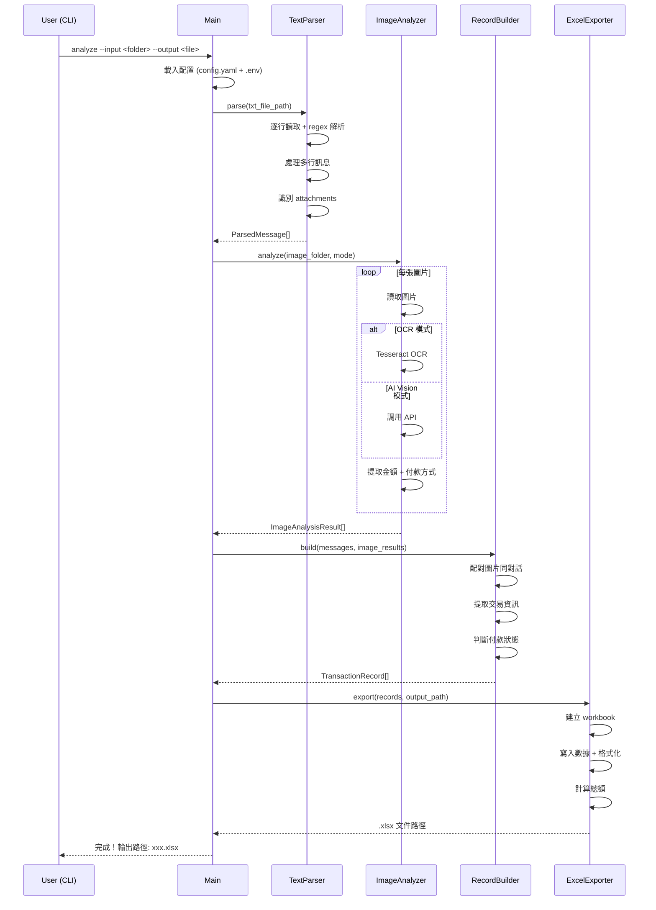
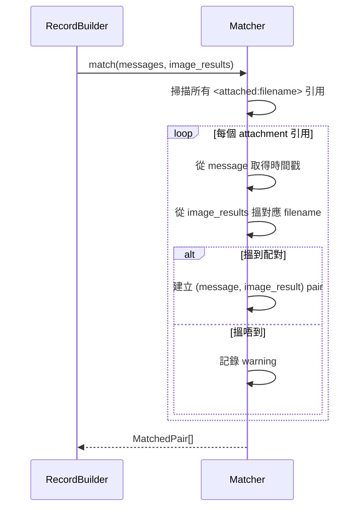
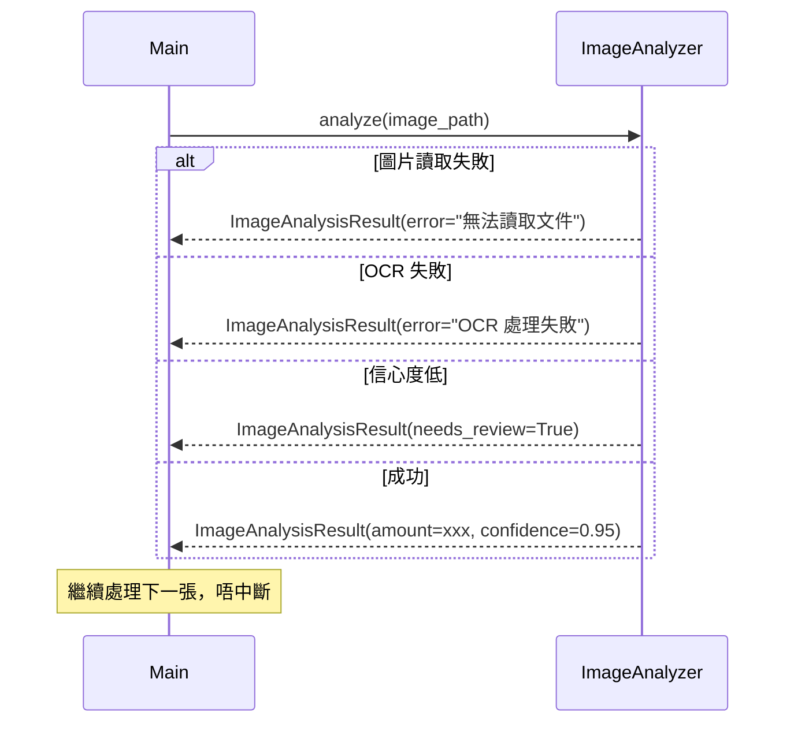

# Design: WhatsApp 帳目分析系統

## Architecture Overview
系統採用 Pipeline 架構，四個模組按順序處理數據。每個模組透過定義好嘅 Pydantic data model 通訊，可獨立測試。Pipeline 支援中斷恢復（每步產出 JSON 中間結果），錯誤隔離確保單個圖片/訊息失敗唔影響整體。

```
Input Files (.txt + images)
        │
        ▼
┌─────────────────────┐
│  WhatsApp Text      │
│  Parser             │──→ ParsedMessage[]
└─────────────────────┘
        │
        ▼
┌─────────────────────┐
│  Image Analyzer     │──→ ImageAnalysisResult[]
│  (OCR / AI Vision)  │
└─────────────────────┘
        │
        ▼
┌─────────────────────┐
│  Transaction Record │──→ TransactionRecord[]
│  Builder            │
└─────────────────────┘
        │
        ▼
┌─────────────────────┐
│  Excel Exporter     │──→ .xlsx file
└─────────────────────┘
```

**設計原則：**
- 模組間透過 Pydantic data model 通訊（明確 interface）
- 每個模組可獨立 unit test（透過 mock input data）
- Pipeline 可中斷恢復（每步產出 JSON 中間結果）
- 錯誤隔離：單個圖片/訊息失敗唔影響整體
- 業務邏輯同 infrastructure（File I/O、API）分層

---

## Technical Decisions

| Decision | Choice | Rationale |
|----------|--------|-----------|
| 程式語言 | Python 3.9+ | 用戶指定；豐富嘅 NLP/OCR 生態 |
| OCR 引擎 | Tesseract (pytesseract) | 免費、離線可用、支援中文 |
| AI Vision | OpenAI Vision API | 準確度高、支援中文 |
| Excel 生成 | openpyxl | 成熟穩定、支援 .xlsx |
| 數據模型 | Pydantic v2 | 類型安全、驗證、序列化、方便 mock |
| CLI 框架 | Click | 簡單易用、文檔完善 |
| 圖片處理 | Pillow (PIL) | 標準 Python 圖片庫 |
| 配置管理 | python-dotenv + YAML | API Key 用 .env，其他用 YAML |
| 日誌 | logging (stdlib) | 內建、夠用 |
| 測試框架 | pytest | Python 標準選擇 |
| 套件管理 | pip + requirements.txt | 簡單直接 |

---

## Data Model

### ParsedMessage
| Field | Type | Description | Constraints |
|-------|------|-------------|-------------|
| timestamp | datetime | 訊息時間戳 | NOT NULL |
| sender | str | 發送者名稱 | NOT NULL |
| content | str | 訊息內容 | NOT NULL |
| is_system_message | bool | 是否系統訊息 | default: False |
| attachments | list[str] | 附件文件名列表 | default: [] |
| raw_text | str | 原始文字（debug 用） | NOT NULL |

### ImageAnalysisResult
| Field | Type | Description | Constraints |
|-------|------|-------------|-------------|
| filename | str | 圖片文件名 | NOT NULL |
| image_date | date \| None | 從文件名提取嘅日期 | nullable |
| analysis_mode | Literal["ocr", "ai_vision"] | 分析模式 | NOT NULL |
| payment_method | Literal["payme", "fps", "bank_transfer", "unknown"] \| None | 付款方式 | nullable |
| amount | Decimal \| None | 金額 | nullable |
| transaction_date | date \| None | 交易日期 | nullable |
| transaction_id | str \| None | 交易編號 | nullable |
| confidence | float | 信心度 | 0.0 - 1.0 |
| raw_text | str \| None | OCR 提取嘅原始文字 | nullable |
| needs_review | bool | 信心度低時標記 | default: False |
| error | str \| None | 分析失敗時記錄原因 | nullable |

### TransactionRecord
| Field | Type | Description | Constraints |
|-------|------|-------------|-------------|
| id | str | UUID | auto-generated |
| date | date | 交易日期 | NOT NULL |
| customer_name | str | 客戶名稱 | NOT NULL |
| repair_item | str \| None | 維修項目 | nullable |
| quantity | int | 數量 | default: 1, >= 1 |
| quoted_amount | Decimal \| None | 報價金額（單價） | nullable |
| received_amount | Decimal \| None | 實收金額 | nullable |
| payment_method | Literal["payme", "fps", "bank_transfer", "cash", "unknown"] \| None | 付款方式 | nullable |
| payment_status | Literal["paid", "unpaid", "partial"] | 付款狀態 | NOT NULL |
| source_messages | list[int] | 來源訊息 indices | default: [] |
| source_images | list[str] | 來源圖片文件名 | default: [] |
| notes | str | 備註 | default: "" |
| confidence | float | 整體信心度 | 0.0 - 1.0 |
| needs_review | bool | 需要人工確認 | default: False |

### AppConfig
| Field | Type | Description | Constraints |
|-------|------|-------------|-------------|
| analysis_mode | Literal["ocr", "ai_vision"] | 分析模式 | default: "ocr" |
| ai_vision_api_key | str \| None | API Key | nullable, from .env |
| tesseract_path | str \| None | Tesseract 路徑 | nullable, Windows 需要 |
| output_dir | str | 輸出目錄 | default: "./output" |
| confidence_threshold | float | 信心度閾值 | default: 0.7 |
| language | str | Tesseract 語言包 | default: "chi_tra+eng" |

---

## API Design

N/A — 本系統為 CLI 工具，無 HTTP API。CLI 介面設計如下：

### CLI Commands

#### `analyze`
- **Description**: 執行完整分析 pipeline
- **Usage**: `python -m src.main analyze --input <folder> --output <file> --mode <ocr|ai_vision>`
- **Parameters**:
  - `--input` (required): 輸入資料夾路徑（含 .txt + 圖片）
  - `--output` (optional): 輸出 .xlsx 路徑，default: `./output/report.xlsx`
  - `--mode` (optional): 分析模式，default: `ocr`
  - `--config` (optional): 配置文件路徑
  - `--verbose` (optional): 顯示詳細日誌
- **Exit Codes**:
  - `0`: 成功
  - `1`: 輸入文件錯誤
  - `2`: 配置錯誤（如 Tesseract 未安裝）

---

## Sequence Diagrams

### 主流程



### 圖片-對話配對流程



### 錯誤處理流程



---

## Component Structure

```
whatsapp-accounting/
├── README.md
├── requirements.txt
├── setup.py
├── .env.example
├── config.yaml
│
├── src/
│   ├── __init__.py
│   ├── main.py               # CLI 入口點 (Click)
│   ├── config.py             # 配置載入
│   │
│   ├── models/               # Data Models (Pydantic)
│   │   ├── __init__.py
│   │   ├── message.py        # ParsedMessage
│   │   ├── image_result.py   # ImageAnalysisResult
│   │   ├── transaction.py    # TransactionRecord
│   │   └── config.py         # AppConfig
│   │
│   ├── parser/               # Module 1: WhatsApp Text Parser
│   │   ├── __init__.py
│   │   ├── text_parser.py    # 主解析邏輯
│   │   ├── patterns.py       # Regex patterns
│   │   └── utils.py          # 時間格式轉換等工具
│   │
│   ├── analyzer/             # Module 2: Image Analyzer
│   │   ├── __init__.py
│   │   ├── base.py           # Abstract base class (interface)
│   │   ├── ocr_analyzer.py   # Tesseract OCR 實現
│   │   ├── ai_vision.py      # AI Vision API 實現
│   │   ├── payment_detector.py  # 付款方式識別
│   │   └── amount_extractor.py  # 金額提取
│   │
│   ├── builder/              # Module 3: Transaction Record Builder
│   │   ├── __init__.py
│   │   ├── record_builder.py # 主整合邏輯
│   │   ├── matcher.py        # 圖片-對話配對
│   │   ├── extractor.py      # 交易資訊提取
│   │   └── status_resolver.py # 付款狀態判斷
│   │
│   └── exporter/             # Module 4: Excel Exporter
│       ├── __init__.py
│       ├── excel_exporter.py # Excel 生成
│       └── formatters.py     # 欄位格式化
│
├── tests/
│   ├── __init__.py
│   ├── conftest.py           # pytest fixtures
│   ├── test_parser/
│   │   ├── __init__.py
│   │   ├── test_patterns.py
│   │   └── test_text_parser.py
│   ├── test_analyzer/
│   │   ├── __init__.py
│   │   ├── test_ocr_analyzer.py
│   │   ├── test_ai_vision.py
│   │   └── test_payment_detector.py
│   ├── test_builder/
│   │   ├── __init__.py
│   │   ├── test_matcher.py
│   │   ├── test_extractor.py
│   │   ├── test_status_resolver.py
│   │   └── test_record_builder.py
│   ├── test_exporter/
│   │   ├── __init__.py
│   │   └── test_excel_exporter.py
│   ├── test_main.py
│   ├── test_e2e.py
│   └── fixtures/
│       ├── sample_chat.txt
│       ├── sample_images/
│       └── expected_output/
│
└── docs/
    └── usage.md
```

---

## Error Handling Approach

### 策略：Graceful Degradation（優雅降級）

| 層級 | 錯誤類型 | 處理方式 |
|------|----------|----------|
| 文件層 | .txt 文件唔存在/無法讀取 | 終止並顯示清晰中文錯誤訊息 |
| 文件層 | .txt 文件為空 | 終止並提示 |
| 解析層 | 單行解析失敗 | 記錄 warning，跳過該行，繼續 |
| 解析層 | 時間格式無法識別 | 嘗試所有已知格式，全部失敗則記錄 |
| 圖片層 | 單張圖片讀取失敗 | 記錄 error，跳過，繼續其他圖片 |
| 圖片層 | OCR 無結果 | 標記 needs_review，繼續 |
| 圖片層 | AI Vision API 失敗 | 回退到 OCR 模式（如可用） |
| 整合層 | 配對失敗 | 記錄 warning，交易紀錄標記為不完整 |
| 匯出層 | 寫入文件失敗 | 終止並顯示錯誤（權限/路徑問題） |

### 日誌分級
- ERROR → 需要用戶注意（文件唔存在、API 失敗）
- WARNING → 可能影響結果（配對失敗、信心度低）
- INFO → 正常進度（處理中、完成）
- DEBUG → 開發用（regex match 詳情、API response）

### 中間結果保存
- 每個模組完成後將結果保存為 JSON（`output/intermediate/`）
- 如果後續步驟失敗，可以從中間結果恢復
- 避免重複處理已分析嘅圖片

---

## Testing Strategy

| Layer | Approach | Tools |
|-------|----------|-------|
| Unit | 每個模組獨立測試，mock 外部依賴（Tesseract、API、File I/O） | pytest + unittest.mock |
| Integration | 模組間串接測試（Parser → Builder、Analyzer → Builder） | pytest + fixtures |
| E2E | 完整 pipeline 測試：sample input → 驗證 .xlsx 輸出 | pytest + openpyxl 讀取驗證 |

### Mock 策略
- Tesseract OCR：mock pytesseract.image_to_string() 返回預設文字
- AI Vision API：mock openai client 返回預設 response
- File I/O：用 pytest tmp_path fixture
- 圖片讀取：用 Pillow 生成簡單 test image

---

## Dependencies

### 核心依賴
| Package | Version | Purpose |
|---------|---------|---------|
| pydantic | ==2.5.0 | Data model 驗證 |
| openpyxl | ==3.1.2 | Excel 生成 |
| click | ==8.1.7 | CLI 框架 |
| pillow | ==10.1.0 | 圖片讀取/處理 |
| pytesseract | ==0.3.10 | Tesseract OCR wrapper |
| python-dotenv | ==1.0.0 | .env 文件載入 |
| pyyaml | ==6.0.1 | YAML 配置 |
| openai | ==1.6.0 | AI Vision API（可選） |

### 開發依賴
| Package | Version | Purpose |
|---------|---------|---------|
| pytest | ==7.4.3 | 測試框架 |
| pytest-cov | ==4.1.0 | 覆蓋率報告 |

### 系統依賴
| Software | Purpose | Notes |
|----------|---------|-------|
| Tesseract OCR | OCR 引擎 | 需要另外安裝 + 中文語言包 (chi_tra) |
| Python 3.9+ | 運行環境 | |

---

## Risks & Trade-offs

| Risk | Impact | Mitigation |
|------|--------|------------|
| OCR 對中文轉帳截圖準確度低 | 金額提取錯誤 | 提供 AI Vision 模式作為備選；標記低信心度結果 |
| WhatsApp 匯出格式更新 | 解析失敗 | 模組化 regex patterns，易於更新；版本偵測 |
| 廣東話 NLP 分析困難 | 維修項目提取唔準確 | 用關鍵字匹配而非完整 NLP；允許人工補充 |
| 付款截圖格式多樣 | 識別率低 | 針對 PayMe/FPS/銀行 App 分別設計 patterns |
| 一個對話混合多個客戶交易 | 配對錯誤 | 用時間窗口 + context 分析區分 |
| Tesseract 安裝複雜（Windows） | 用戶安裝困難 | 提供詳細安裝指南 |
| AI Vision API 費用 | 用戶唔想付費 | OCR 模式為預設免費方案 |
